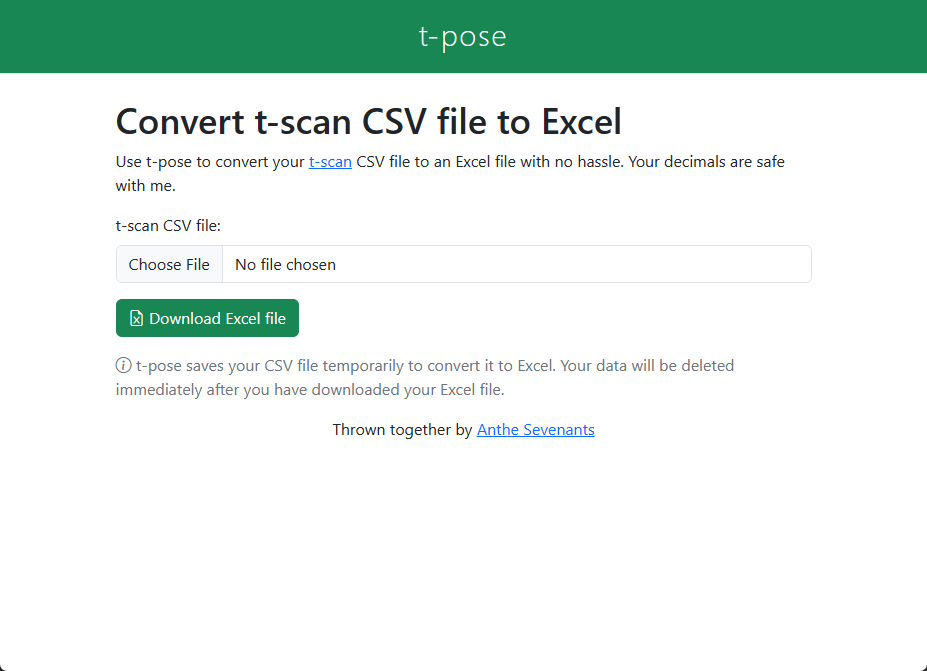

# t-pose
Frontend to convert t-scan CSV files to Excel

## What is t-pose?

Many master students who run [t-scan](https://tscan.hum.uu.nl/tscan/) for text complexity analyses run into trouble when they try to convert the tool's CSV output to Excel for further analysis. European Excels get confused when different decimal separators are used, which causes all sorts of annoying issues. The t-pose frontend solves all these issues by allowing you to convert a t-scan CSV file to Excel in seconds. Save the decimals!



## Usage with `docker compose`

For use in production:

```
version: "3"

services:
  python:
    build:
      context: .
      dockerfile: .docker/Dockerfile
    ports: 
      - "80:8080"
    environment:
      CACHE_DIR: cache/
      PYTHONUNBUFFERED: 1
    volumes:
      - ./cache/:/usr/app/src/cache
```

For development:

```
version: "3"

services:
  python:
    build:
      context: .
      dockerfile: .docker/Dockerfile_dev
    ports: 
      - "8080:8080"
    environment:
      CACHE_DIR: cache/
      PYTHONUNBUFFERED: 1
    volumes:
      - .:/usr/app/src
```

Save as `docker-compose.yml`, then run `docker compose up` or `docker-compose up`. Depending on the configuration you chose (production/dev), t-pose will be available at port `80` or `8080`.